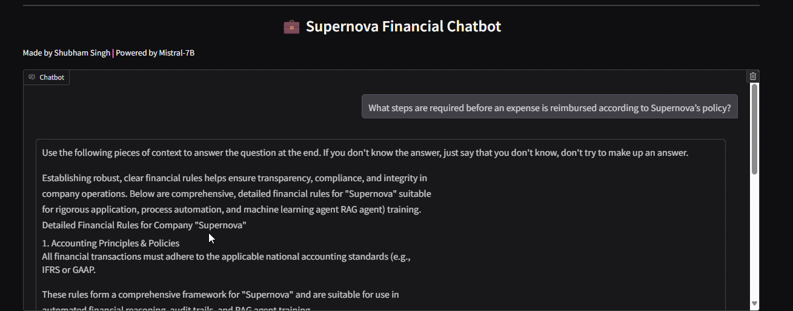
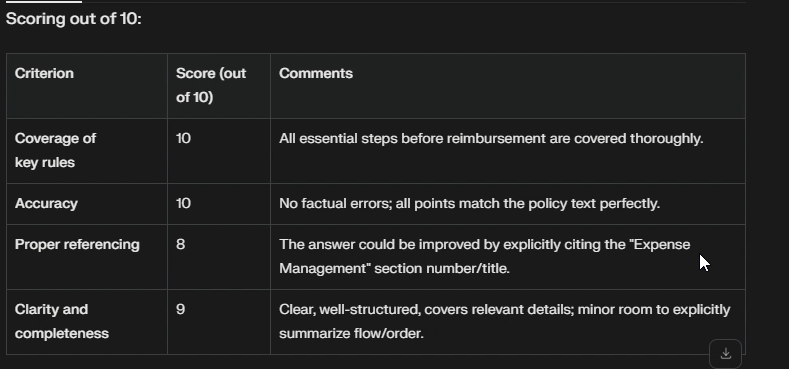

Supernova Financial RAG Agent
📖 Overview

The Supernova Financial RAG Agent is an advanced Retrieval-Augmented Generation (RAG) chatbot built using Mistral-7B. It provides reliable, policy-compliant financial answers by grounding responses in structured financial rules. The system ensures transparency, compliance, and efficiency in corporate operations by combining retrieval-based context injection with LLM reasoning.

🚀 Key Features

✅ RAG-powered chatbot: Ensures answers are grounded in financial rules and policies.

✅ Policy compliance: Adheres to IFRS/GAAP accounting standards.

✅ Context-aware responses: Pulls information dynamically from provided documents.

✅ Interactive interface: Built using Gradio for ease of use.

✅ Evaluation pipeline: Automated scoring of chatbot responses based on accuracy, coverage, and clarity.

🛠 Tech Stack

LLM: Mistral-7B (via Hugging Face)

Framework: LangChain

Libraries: PyTorch, Transformers

Interface: Gradio

Other Tools: FAISS / vector embeddings for retrieval

📂 Project Structure
Supernova-Financial-RAG-Agent/
│── rag_agent.py                 # Core RAG chatbot implementation
│── rag_agent_demo.png           # Demo screenshot
│── rag_agent_evaluation.png     # Evaluation screenshot
│── requirements.txt             # Python dependencies
│── README.md                    # Documentation

⚡ Installation
git clone https://github.com/shubham-61291/AI-Playground.git
cd "Supernova Financial RAG Agent"
pip install -r requirements.txt

▶️ Usage
python rag_agent.py

This will launch a Gradio web interface where you can chat with the RAG-powered financial assistant.

🖼 Demo
## 🖼 Demo  

### 🔹 Chatbot in Action  
  

### 🔹 Evaluation Metrics  
  

🔮 Future Enhancements

🔹 Add support for multi-document retrieval

🔹 Fine-tune with domain-specific financial datasets

🔹 Integrate speech-to-text pipeline for voice-based queries

🔹 Add explainability layer for transparent decision-making

👨‍💻 Author

Shubham Singh

License

MIT License
