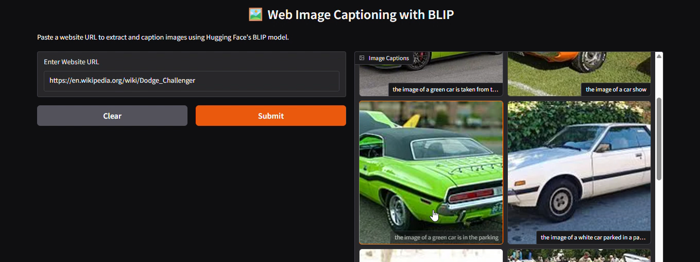

Image Captioning with BLIP
Overview

This project implements image captioning using Hugging Face’s BLIP (Bootstrapping Language-Image Pre-training) model.
It allows generating descriptive captions for both uploaded images and images extracted from websites.
The project demonstrates the integration of state-of-the-art vision-language models into a user-friendly Gradio interface.

Project Details
1. Image Upload Captioning (image_captioning_using_huggingface.py)

A Gradio interface where users can upload an image and receive an auto-generated caption.

Key Features:

Single image upload support.

BLIP model generates concise captions.

Lightweight and easy to run locally.

2. Web-Based Image Captioning (image_captioning_using_huggingface.py)

An extended feature where users can paste a website URL, and the app will fetch up to 10 images, generate captions, and display them in a gallery.

Key Features:

Extracts images from webpages using BeautifulSoup.

Handles relative and broken image URLs.

Limits processing to 10 images per page for efficiency.

Provides captions in a clean gallery-style output.

Technical Details

Frameworks: PyTorch, Hugging Face Transformers, Gradio

Model: Salesforce/blip-image-captioning-base

Libraries Used:

transformers → Load BLIP model and processor

torch → Inference backend

gradio → Web interface

requests → Fetch images from the web

pillow (PIL) → Image preprocessing

beautifulsoup4 → Parse HTML and extract image tags

Hardware Requirements:

Runs on CPU (slower).

GPU recommended for faster performance.

Dataset

No additional dataset is required. The BLIP model is pretrained on large-scale vision-language corpora and made publicly available on Hugging Face Hub.

Usage
Installation
pip install -r requirements.txt

Running the App
python image_captioning_using_huggingface.py

After execution, Gradio will generate a local URL and a shareable public link.
Open the link in your browser to test the app.

Requirements

Python 3.7+

Transformers 4.30.2

Torch

Gradio

Requests

Pillow

BeautifulSoup4

Results
Image Upload Captioning
## Demo  

  
  

Website-Based Captioning
## Demo  
 
  

DEMO VIDEO :- https://www.youtube.com/watch?v=VHFnyVZX7z4&list=PLlRRgrbOaGcYU__fUcQFO1bBILOkAhCZE&index=2

Future Enhancements

Multi-image upload in one run.

Export captions to CSV/JSON.

Integration with CLIP for ranking captions.

Deploy on Hugging Face Spaces for public access.

Author

Shubham Singh

License

MIT License
