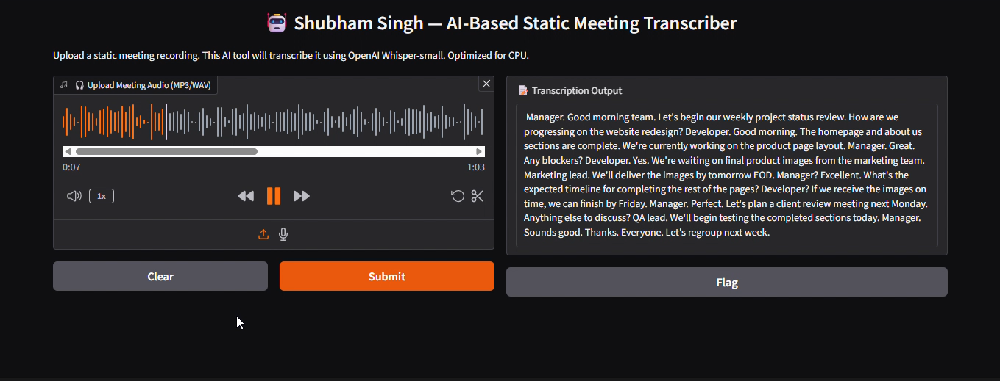

Meeting Transcriber – Whisper Small
Overview

This project implements an AI-based meeting transcriber using Hugging Face’s Whisper Small model.
It allows users to upload recorded meeting audio (MP3/WAV) and receive a text transcript through a Gradio interface.
The project is part of the AI-Playground repository, which demonstrates practical AI applications.

Project Details
1. Static Meeting Transcription (gradiobasedmeetingtranscriber.py)

A Gradio-based application that processes uploaded meeting recordings and generates text transcripts.

Key Features:

Powered by Hugging Face’s openai/whisper-small model.

Supports MP3 and WAV file formats.

Simple interface with personalized branding.

Optimized for CPU-only environments.

Technical Details

Frameworks: PyTorch, Hugging Face Transformers, Torchaudio, Gradio

Model: openai/whisper-small

Input: Uploaded meeting recording (MP3/WAV)

Output: Text transcription displayed in UI

Hardware Requirements:

Works on CPU (suitable for demos and short recordings).

Faster and more accurate results with GPU.

Usage
Installation
pip install -r requirements.txt

Running the App
python gradiobasedmeetingtranscriber.py

After execution, Gradio will generate a local and public URL.
Open the link in your browser to upload audio and view transcripts.

Requirements

Python 3.7+

Transformers 4.30.2

Torch

Torchaudio

Gradio

Demo

DEMO VIDEO :- https://www.youtube.com/watch?v=sdGgobRCUFw&list=PLlRRgrbOaGcYU__fUcQFO1bBILOkAhCZE&index=3

## Demo  

  

Future Enhancements

Add support for more formats (M4A, OGG).

Option to download transcripts as text files.

Integrate timestamps for speaker segments.

Explore larger Whisper models for higher accuracy.

Real-time (streaming) meeting transcription.

Author

Shubham Singh

License

MIT License
