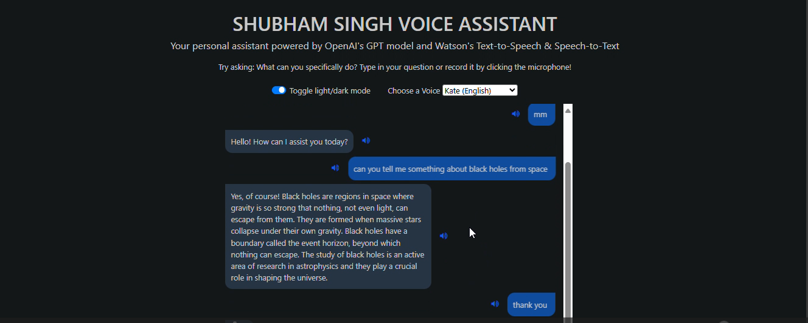

🎙️ Voice Assistant – Watsonx  

A personal AI-based voice assistant powered by **OpenAI GPT** and **IBM Watson (STT + TTS)**.  
This project allows real-time interaction using **speech-to-text** and **text-to-speech**, enabling natural conversations with AI.  

---

## 🚀 Features
- 🎤 **Speech-to-Text (STT)**: Convert your voice to text using Watson Speech-to-Text.  
- 🔊 **Text-to-Speech (TTS)**: Listen to AI responses in natural voices.  
- 🤖 **GPT-Powered Responses**: Intelligent conversation powered by OpenAI GPT.  
- 🌙 **Light/Dark Mode** toggle in UI.  
- 🌍 Multi-language & multiple voice support.  

---

## 🛠️ Tech Stack
- **Python** (Flask backend)  
- **OpenAI GPT** (conversation engine)  
- **IBM Watson STT & TTS (sandbox endpoints)**  
- **HTML/CSS/JS** (frontend with dark/light mode toggle)  

---

## 📸 Demo
DEMO VIDEO :- https://www.youtube.com/watch?v=-BZwDb9a9pk&list=PLlRRgrbOaGcYU__fUcQFO1bBILOkAhCZE&index=5
  

---

## ⚙️ Installation

```bash
# Clone repository
git clone https://github.com/<your-username>/AI-Playground.git
cd AI-Playground/voice-assistant-watsonx

# Install dependencies
pip install -r requirements.txt

# Run server
python server.py
Then open http://localhost:5000 in your browser.

📦 Requirements
See requirements.txt for full list.

🔮 Future Enhancements
Real-time streaming STT (instead of static chunks).

Enhanced voice emotion & tone controls.

Replace IBM sandbox endpoints with production-grade APIs.

Integration with other assistants (calendar, notes, etc).

👨‍💻 Author
Shubham Singh

📜 License
MIT License 
